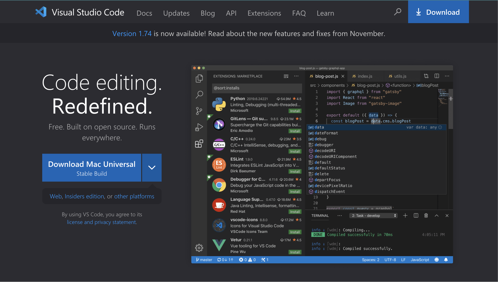
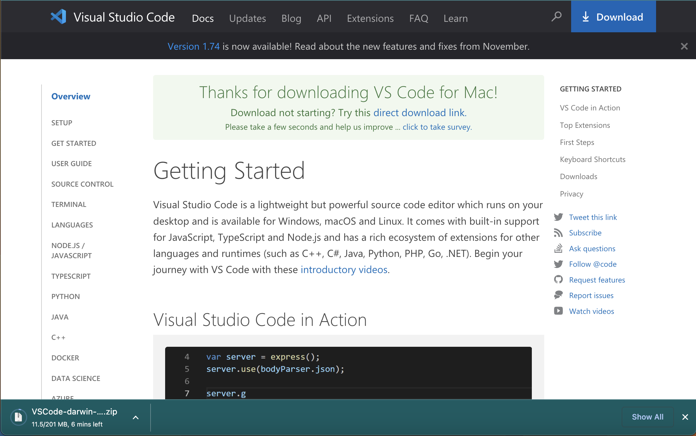
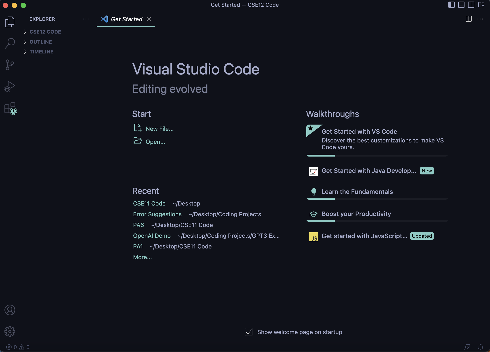
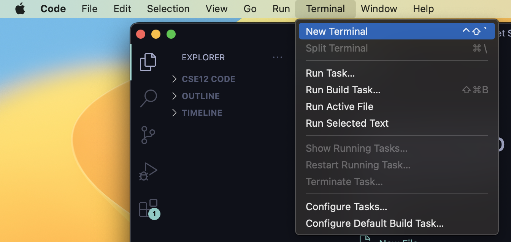
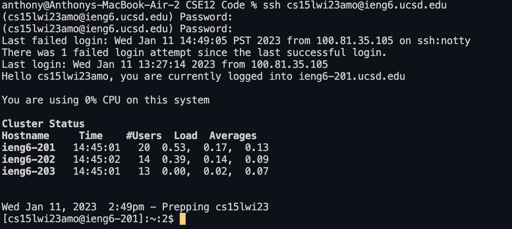
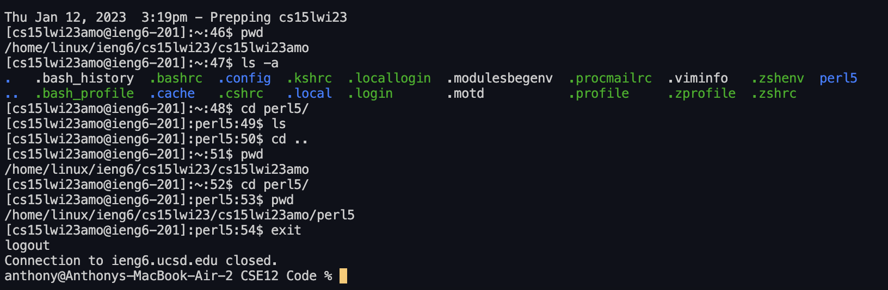

# Week 1 Lab Report
Today's topic: Remote Access!   
We will be going over how to log in to a course specific account on **ieng6**. 
   
## **Step 1: Installing VSCode**
First things first, we need to visit the VSCode website. Begin by searching VSCode on Google and 
clicking the first page or by visiting [this link](https://code.visualstudio.com/).  
Once you see the page shown below, click the download button to download VSCode onto your computer.
   

   
You should see the install progress at the bottom of your page, as shown below. Once it finishes installing, click it and follow the instructions to get VSCode up and running!
    

   
When you've finished, if everything has gone correct, you should see something similar to what is pictured below! If you do, this means you have completed Step 1! On to Step 2!
   

    
## **Step 2: Remotely Connecting**
Now that we have VSCode successfully installed, we can remotely connect to the ieng6 server! Let's begin by open the terminal on VSCode, which can be accessed by pressing "Terminal" then "New Terminal" on the Menu Bar when on VSCode (pictured below).
   

    
From here, we will type a command into the terminal to begin remote access.  
`ssh (YOUR COURSE SPECIFIC USERNAME)@ieng6.ucsd.edu`   
Here is the command I used:   
`ssh cs15lwi23amo@ieng6.ucsd.edu`
   
From here, you may get prompted with a message asking for permission. Just type 'yes' and press enter. After this, you will get prompted for your password. Type it in, and if you connect, you should see something like this (pictured below)! If you do, you are finished with Step 2!   
   

   
## Step 3: Trying Some Commands
Now that we are logged in, we can try some commands to play around with our new environment! Below is a screenshot of some of the commands I used and their outputs:
    

    
What are some of the commands I demo'd and what do they do?   
   
**'pwd'** - this shows the absolute path to the directory you are in right now.   
**'ls'** - this shows the files/folders in the current directory.   
**'cd [folder-name]'** - this sets the current directory to the folder you specified.   
**'cd ..'** - this sets the current directory to the parent of the director you were in.    
