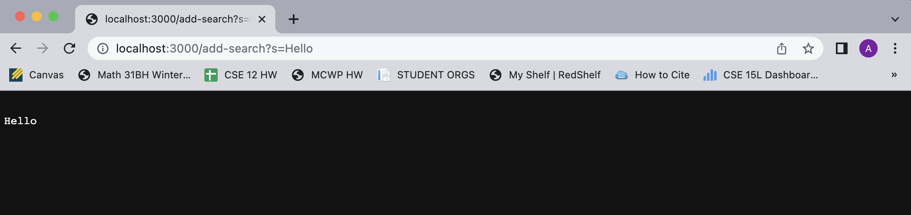

# Week 2 Lab Report
Today's topic: Servers and Bugs!   
We will be making a **web server** and doing some **debugging**. Woohoo! 
   
## **Part 1: String Server**
First things first, I will be demo-ing my StringServer program. This server keeps track of a single string that can get added to based on the user's requests. Here's the code:    

~~~java
import java.io.IOException;
import java.net.URI;

class Handler implements URLHandler {
    // The one bit of state on the server: a string that will be manipulated by
    // various requests.
    String mainString = "";

    public String handleRequest(URI url) {
        if (url.getPath().contains("/add-search")) {
            String[] parameters = url.getQuery().split("=");
            if (parameters[0].equals("s")) {
                mainString = mainString + "\n" + parameters[1]; 
            }
            return mainString;
        }
        return "404 Not Found!";
    }
}

class StringServer {
    public static void main(String[] args) throws IOException {

        if(args.length == 0){
            System.out.println("Missing port number! Try any number between 1024 to 49151");
            return;
        }

        int port = Integer.parseInt(args[0]);

        Server.start(port, new Handler());
    }
}

~~~
    
It's hard to tell just off looking at the code exactly what the program is doing, but no worries, here are some examples of me using it along with explanations of what is going on in the program: 
    

    
When I type in the link http://localhost:3000/add-search?s=Hello, the program goes to the handleRequest method (which is called whenever the page is loaded or reloaded). The current url is passed in to the handleRequest method when it runs. The method first checks with the url path contains 'add-search', which it indeed does, so it goes inside the if statement. Then, it splits the query to determine what the user is trying to add to the string that will be displayed on the page. 
