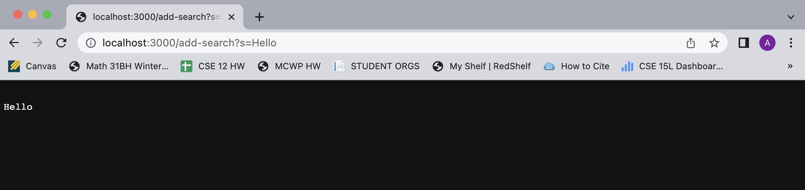
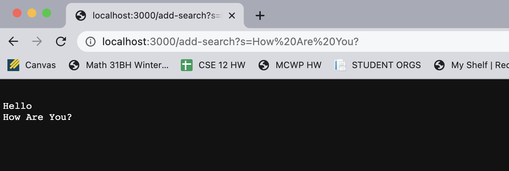
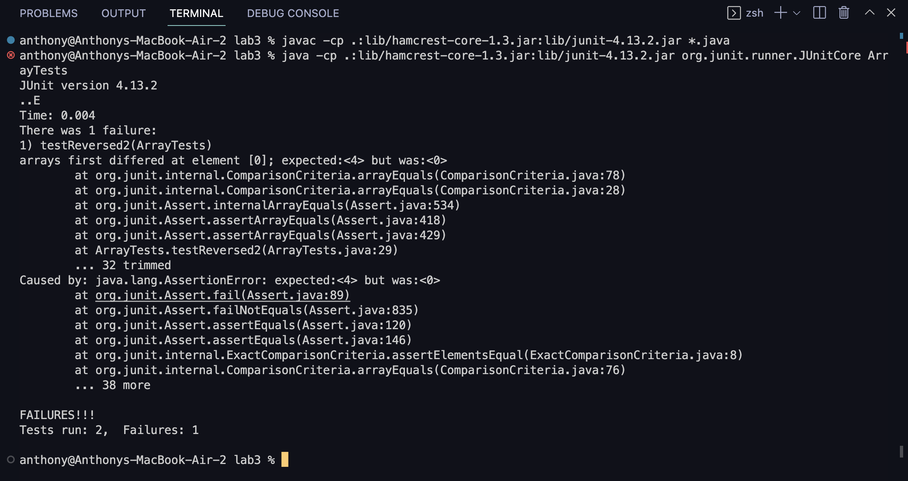

# Week 2 Lab Report
Today's topic: Servers and Bugs!   
We will be making a **web server** and doing some **debugging**. Woohoo! 
   
## **Part 1: String Server**
First things first, I will be demo-ing my StringServer program. This server keeps track of a single string that can get added to based on the user's requests. Here's the code:    

~~~java
import java.io.IOException;
import java.net.URI;

class Handler implements URLHandler {
    // The one bit of state on the server: a string that will be manipulated by
    // various requests.
    String mainString = "";

    public String handleRequest(URI url) {
        if (url.getPath().contains("/add-search")) {
            String[] parameters = url.getQuery().split("=");
            if (parameters[0].equals("s")) {
                mainString = mainString + "\n" + parameters[1]; 
            }
            return mainString;
        }
        return "404 Not Found!";
    }
}

class StringServer {
    public static void main(String[] args) throws IOException {

        if(args.length == 0){
            System.out.println("Missing port number! Try any number between 1024 to 49151");
            return;
        }

        int port = Integer.parseInt(args[0]);

        Server.start(port, new Handler());
    }
}

~~~
    
It's hard to tell just off looking at the code exactly what the program is doing, but no worries, here are some examples of me using it along with explanations of what is going on in the program: 
    

    
When I type in the link http://localhost:3000/add-search?s=Hello, the program goes to the handleRequest method (which is called whenever the page is loaded or reloaded). The relevant argument is the current url, which is passed in to the handleRequest method when it runs.   

The method first checks if the url path contains 'add-search', which it indeed does, so it goes inside the if statement. Then, it splits the url query to determine the string the user is trying to add. After determining the string, it is appended to mainString, along with a new line in order to separate each new addition.    
(mainString holds the value of all the strings that have been added so far, and is added to each time the user adds anything).  

If the url path doesn't contains 'add-search', the method simply returns '404 Not Found!' as the path is invalid.    
   
Here's another example:   

    
This time, mainString isn't empty, as it has the 'Hello' from earlier. The method goes through the same logic, except the argument passed into the method is the new url containing the 'How Are You?' string in it.   

Since the url contains 'add-search', it appends the 'How Are You?' to mainString, and after returning mainString it now displays the 'Hello' as well as the 'How Are You?'.
    
## **Part 2: Debugging**
Here's an example of me testing a method, finding the bugs in it, and fixing them! This method is meant to take in an array, and return a new array that is equivalent to the old array reversed.    
    
Here's the tests I ran to see whether it worked properly:   

*Testing whether an empty array worked fine:*
~~~
@Test
public void testReversed() {
   int[] input1 = { };
   assertArrayEquals(new int[]{ }, ArrayExamples.reversed(input1));
}
~~~
    
*Testing whether it works for an array with elements:*
~~~
@Test
public void testReversed2() {
   int[] input = {1,2,3,4};
   assertArrayEquals(new int[]{4,3,2,1},ArrayExamples.reversed(input));
}
~~~
   
Here's what occurred when I ran these tests with JUnit:  

   
From this output, we can tell that the method works when the input array is empty, but doesn't work when the array has elements. In fact, instead of the new reversed array starting with a 4, it started with a 0. Let's examine the code to find a possible reason as to why the returned array has a 0 in it.
   
~~~
static int[] reversed(int[] arr) {
   int[] newArray = new int[arr.length];
   for(int i = 0; i < arr.length; i += 1) {
      arr[i] = newArray[arr.length - i - 1];
   }
   return arr;
}
~~~
The only variable containing any zeros is newArray, as when any int array is instantiated it is set with all 0 values. This means the lines containing newArray are likely to be the issue. If we look at the line where we set the individual elements of arr to values of newArray, it becomes clear that since the elements of arr are being set to elements of newArray arr just becomes an array of zeros. This leads us to this fix:

~~~
static int[] reversed(int[] arr) {
   int[] newArray = new int[arr.length];
   for(int i = 0; i < arr.length; i += 1) {
      newArray[i] = arr[arr.length - i - 1];
   }
   return newArray;
}
~~~

By setting the values of newArray to elements of arr instead of vice verca, we are keeping the values of arr and reversing them rather than replacing them with zeros. Thus, newArray will contain the values of arr in reverse, and returning newArray will yield the correct output! We've fixed the bug!
     
## **Part 3: What I Took Away**
Pretty much most of Lab 2 was new to me, as I had never made a web server with a Java program. It was really cool for me to learn how to take requests based on the url input and do things with the program! Implementing the search engine in week 2's lab was an awesome learning experience for me, and it was cool to have my program work on the web, as I knew if I hosted it anyone could run it! I didn't really know it was even possible to get a Java program to work as a web server, but now that I not only know its possible but also know how to do it I'm excited for further experimentation.   

Well, that concludes the lab report! Thanks for reading.

-Anthony :)
