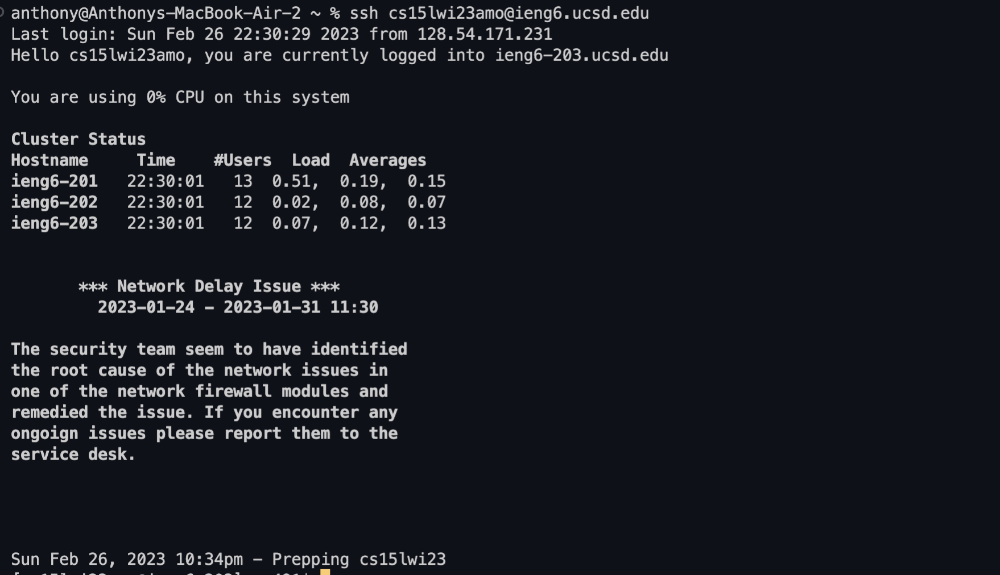
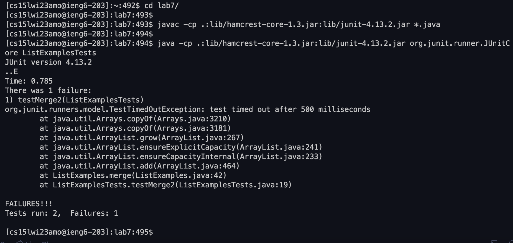

# Week 7 Lab Report
Today's topic: Speeding through tasks on the command line!

For the tasks outlined in the lab, I was able to run all of them at once by putting the commands for each step in a Google Doc, then 
by copying all the commands and pasting them at once in the terminal! Using this strategy, I was able to finish steps 4-9 in just 8 seconds
and win the class competition!
    
## Step 4 ##
Step 4 was the only step I didn't paste in. Here's what I did to run this step:   

Keys pressed: <up><enter>
  
The command to login to my account on the ieng6 server, ```ssh cs15lwi23amo@ieng6.ucsd.edu```, was 1 up in the search history, so I 
pressed the up arrow once to access it. When I entered this command, because I set up SSH keys for ieng6 during the lab, it automatically
logged me in without the need for me to type in my password. Here's what the command outputted: 
  

    
## Steps 5-9 ##
For steps 5-9, I already had all the commands in my computer's clipboard as I had highlighted this whole Google Doc and used Command-C
to copy all the commands. Here's a screenshot of the Google Doc:
  


To perform the steps: 
    
Keys pressed: <command-v>

Since all the commands were in my clipboard, this pasted all the commands in and ran them automatically in my terminal.
    
The first command that ran was ```git clone git@github.com:Anthonyp0329/lab7.git```. This cloned my fork of the lab 7 repository, performing step 5.


    
The next commands that ran were ```cd lab7/``` as well as the commands to run the tester, which were ```javac -cp .:lib/hamcrest-core-1.3.jar:lib/junit-4.13.2.jar *.java``` and ```java -cp .:lib/hamcrest-core-1.3.jar:lib/junit-4.13.2.jar org.junit.runner.JUnitCore ListExamplesTests```. This went into the repository folder and ran the testers, performing step 6. Here was the output:


    
Next, the command to edit the code ran, which was ```sed -i '43 s/index1/index2/' ListExamples.java```. The ```sed``` command takes in a string, and replaces it with the new string. In this case, it searched for ```index1``` and replaced it with ```index2``` in the ListExamples file. Since I didn't want all of the ```index1```'s replaced, I specified to replace the one on line 43, which fixes the code. The ```-i``` option saved the new changes into the ListExample file, completing step 7. Here's what running this command looked like: 


    
Now, I had to run the testers again to verify the changes worked and the code passed the tests now. This completes step 8. Here's what it looked like when I ran the commands, and the output of the tester:
    

    
Now that the code works, we want to push these changes to GitHub. I did this by running these commands in this order: ```git add ListExamples.java```, 
```git commit -m “yay”```,```git push origin main```. The first command added the changes I made, then the second command committed them with the message "yay", and the final command updated the repository by pushing to main. Here's what running these commands looked like, which completed step 9:
    

    
This is how I was able to complete these tasks as quick as possible! I think what really helped me was the VSCode terminal, which was able to run each command sequentially just by me pasting them all in. Thanks for reading :)!

-Anthony 
